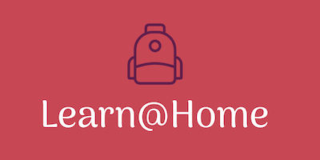
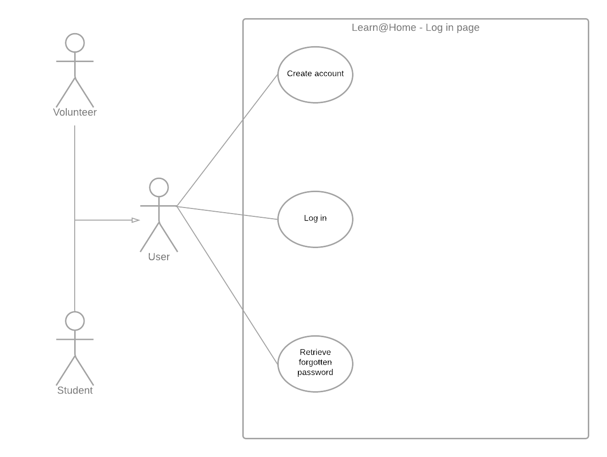
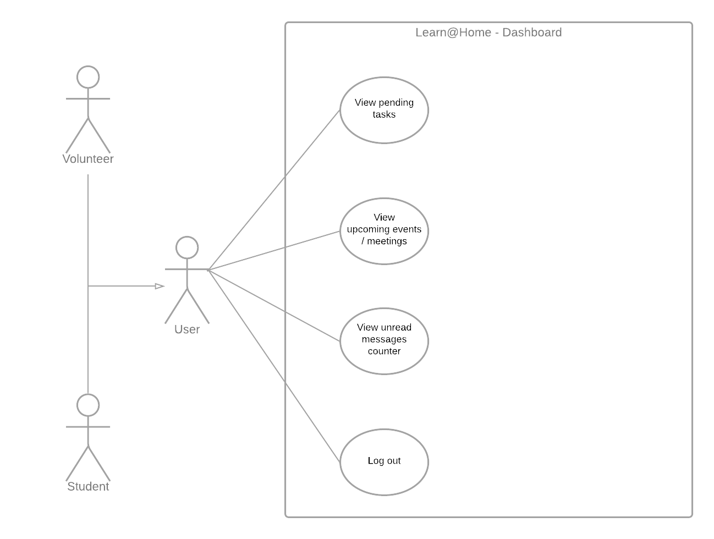
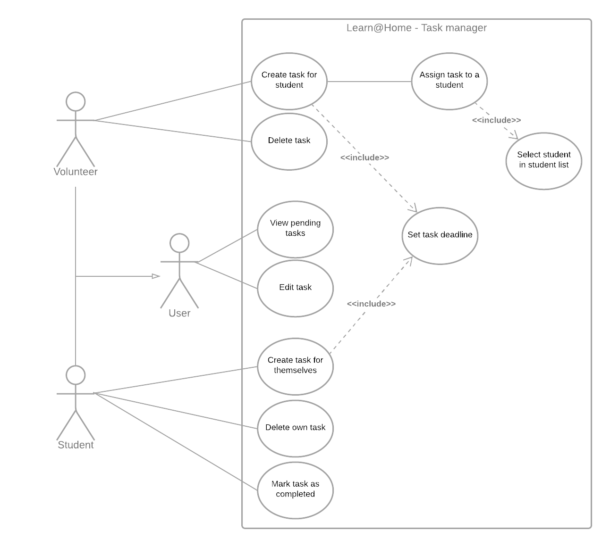
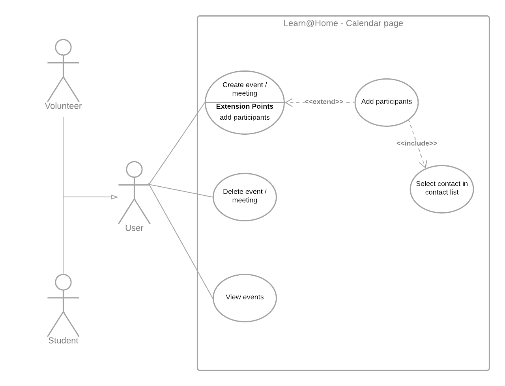
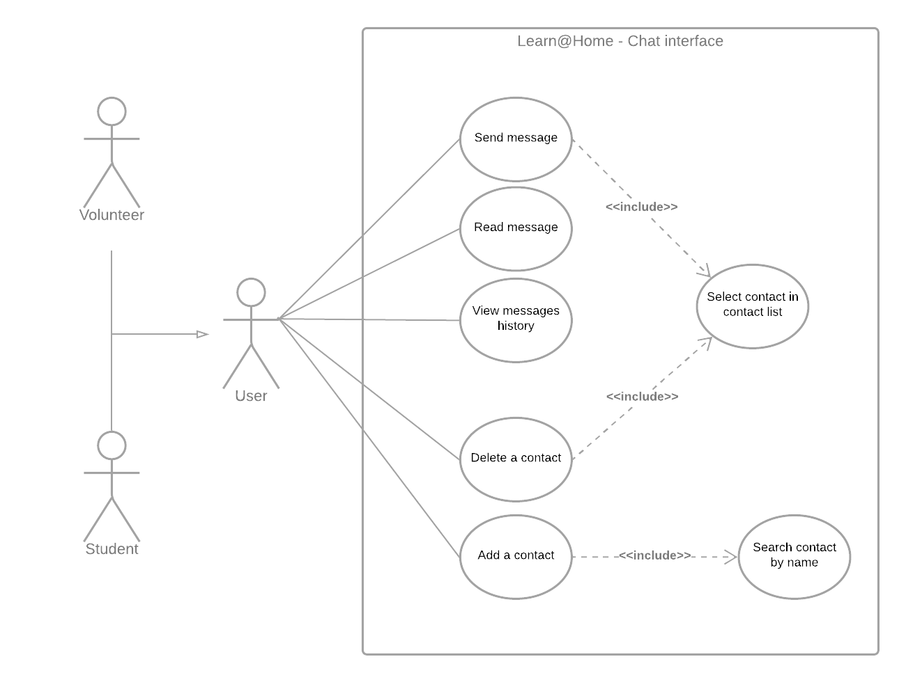
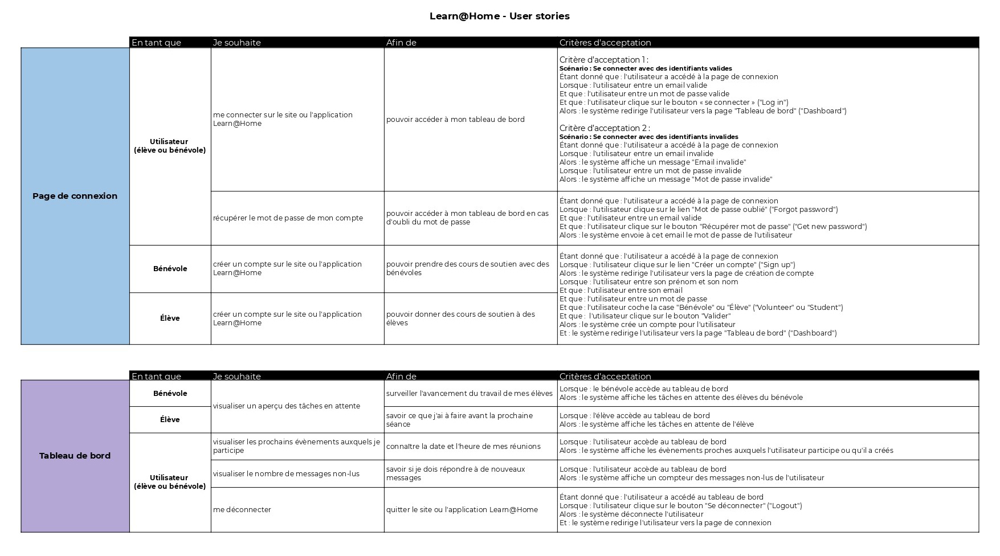
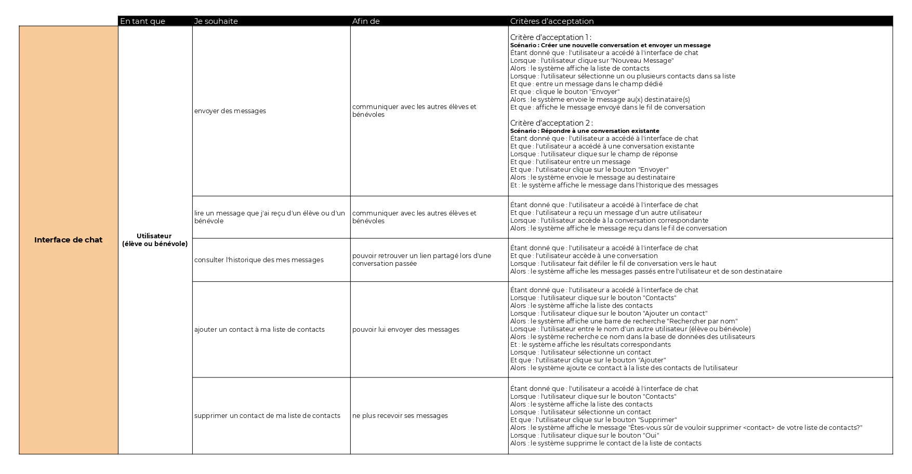
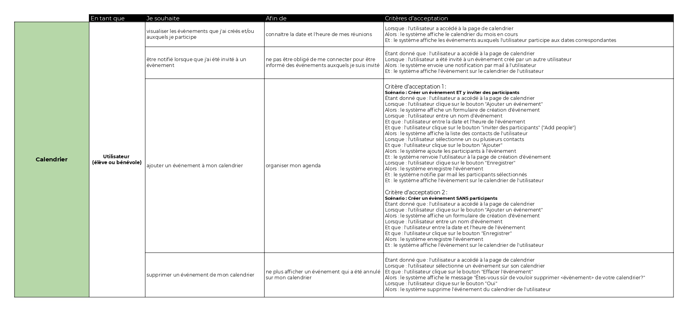
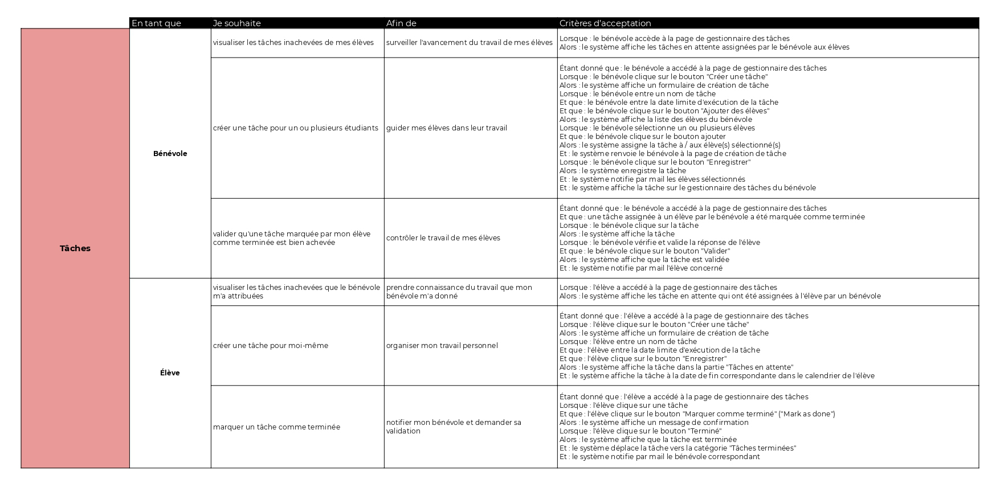

  

# Projet 3 DA-Python OC (Hélène Mignon)
***Livrable du Projet 3 du parcours D-A Python d'OpenClassrooms :***

**Learn@Home** est une association qui met en relation des enfants en difficulté
scolaire et des bénévoles, en ligne. Elle a pour objectif de permettre à tout élève,
où qu’il soit, d’accéder à un soutien scolaire à distance.

Pour faciliter les interactions et la communication, **Learn@Home** souhaite créer
un nouveau site web, qui doit être composé des pages suivantes :
- Une page de connexion
- Une page Tableau de bord
- Une page Interface de chat
- Une page de calendrier
- Une page de gestion des tâches

### Objectifs du projet :

Définir les besoins client et les exigences fonctionnelles d'une application de soutien scolaire 
grâce à des diagrammes de cas d'usage, des user stories, des maquettes fonctionnelles et un kanban.

## Table des matières

1. [Cas d'usage](#use-cases)

2. [User stories](#user-stories)

3. [Maquettes fonctionnelles](#wireframes)

4. [Tableau kanban](#kanban)

## 1. Cas d'usage

Diagrammes de cas d'usage pour chacune des fonctionnalités majeures de chaque page de l'application ([version PDF](use_cases.pdf)). Réalisés avec [Lucidchart](https://www.lucidchart.com/).

  
    Page de connexion

  
    Tableau de bord

  
    Tâches

  
    Calendrier

  
    Interface de chat

## 2. User stories

User stories définissant le(s) critère(s) d'acceptation pour chacune des fonctionnalités de l'application ([version PDF](user_stories.pdf)).

  
  
  
  

## 3. Maquettes fonctionnelles

Réalisée avec [Balsamiq Wireframes](https://balsamiq.com/wireframes/), les maquettes fonctionnelles du site sont disponibles en version [desktop](wireframes_desktop.pdf) ou [mobile](wireframes_mobile.pdf). Il est possible de naviguer en cliquant sur les liens et les boutons en <mark style="background-color:#d47b7b">surbrillance</mark>.

## 4. Tableau kanban

[Tableau kanban](https://trello.com/b/uG3w4YDh/p305kanban) réalisé sur [Trello](https://trello.com/) découpant le projet en blocs de fonctionnalités et sous-fonctionnalités et reprenant le(s) critère(s)
d'acceptation présentés dans les [user stories](#2-user-stories).
